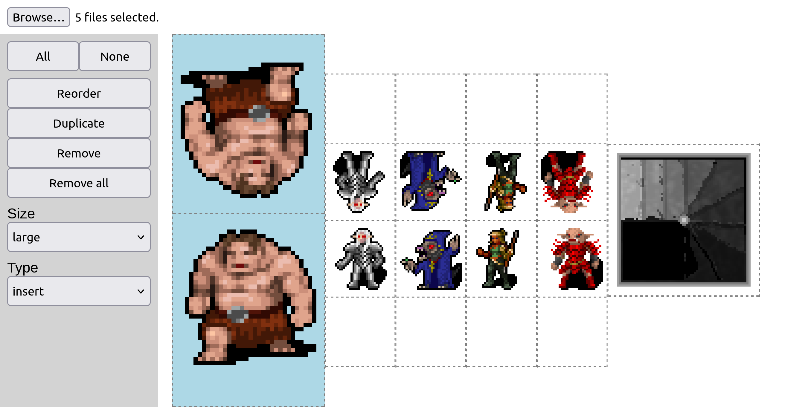

# RPG token layout

A simple tool to layout and print paper tokens for table-top RPG games. You can drop in image files, and the tool will configure them as printable and cuttable tokens to use on your map. The tool supports different token styles:

* A-frame (front and back, with a base, good for monsters)
* Box (top, front and back, good for blocks and things you stand on)
* Flat (good for scenery or features on the floor)
* Insertable (front and back, useful for plastic stands or binder clips)

## Running

I'll host it somewhere at some point, but for now clone the repo, run "npm ci" and then:

```
npm run serve
```

Then point your browser to localhost:4200

## Usage

Just browse and insert your artwork, then configure the size and type of each piece as you like. The print sizes are based on the D&amp;D standard for large (just under 2 inch base), medium (just under 1 inch base) and small. (0.5 inch base)



## Limitations

There are some limitations to the layout algorithm so it tends to waste paper under certain conditions. Currently it arranges all the pieces in rows with the height of each row dictated by the height of the largest piece.

If you have lots of pieces to print, I'd recommend grouping similar sizes together on a page. (eg try to get a page of all large sizes, with mediums on a separate page) That will tend to waste less paper.

Also it would be nice if the piece shapes could be configured a bit more. (eg specifying image margins etc)
